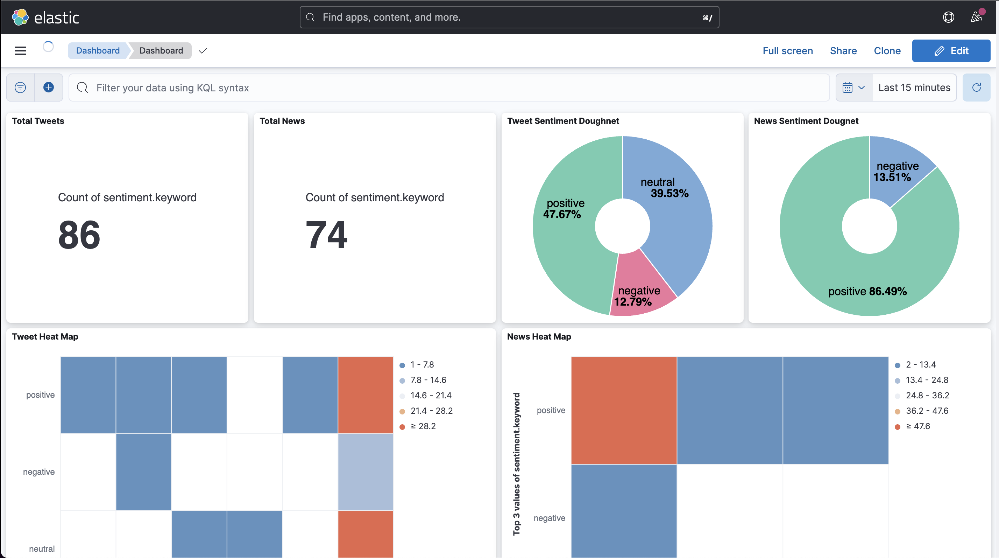
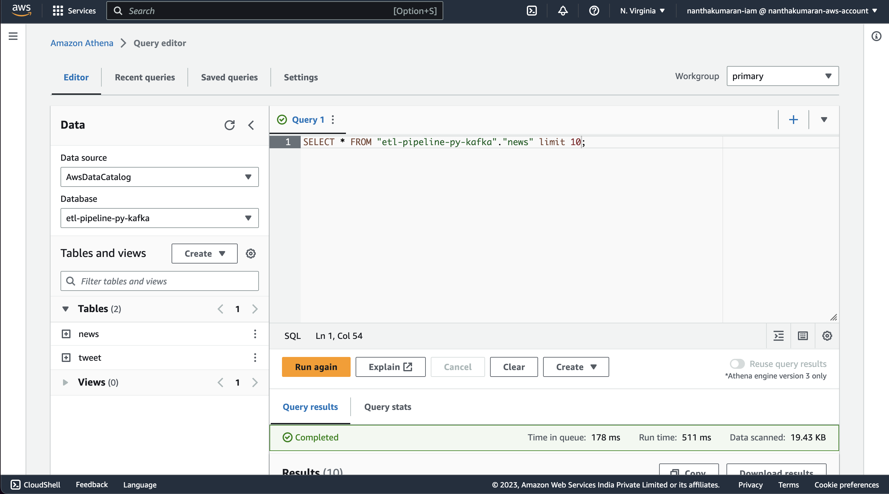

# ETL Pipeline for Tweets and News using Python, Kafka, AWS and ELK Stack

In this ETL pipeline, we are trying to analyze the sentiment of the users about Google with tweets and news as our data source.

[Demo Video](https://drive.google.com/file/d/1cx93UhIAicLN9uKmINEcDUvdAS0tpotb/view?usp=sharing)

## Stacks

- Python
- Kafka with Zookeeper
- AWS (Crawlers, Glue, Athena)
- ELK (Elastic Search, Kibana)
- textblob (Sentiment analysis)

## Architecture of the application


## Running the ETL Pipeline

### Step 1: Start Kafka, Elastic Search and Kibana

Run the following command to start the kafka brokers with the zookeeper, Elastic Search and Kibana

```sh
docker compose up
```

### Step 2: Extract

To extract data from the source, you need to run the following commands in different terminal

```sh
python3 extract/tweet_producer.py
```

```sh
python3 extract/news_producer.py
```

To check if the producer produces any data, run the following commands in different terminal

```sh
kafka-console-consumer.sh --topic Tweets_Topic --bootstrap-server localhost:9092 --from-beginning

or

kafka-console-consumer.sh --topic News_Topic --bootstrap-server localhost:9092 -from-beginning
```

If it produces any data then the extract part is working fine.

### Step 3: Transform

After extracting the data from the source, you need to run the following commands in different terminal to transform the data and add sentiment prediction to the data

```sh
python3 transform/tweet_transformer.py
```

```sh
python3 transform/news_transformer.py
```

To check if it transforms the data, run

```sh
kafka-console-consumer.sh --topic Processed --bootstrap-server localhost:9092 --from-beginning
```

If the messages has `sentiment` in it then the transformers works fine.

### Step 4: Load

In this step you need to create a S3 bucket and replace the one with the default in `load/aws_consumer.py`. After that run the following commands in different terminal

```sh
python3 load/aws_consumer.py
```

```sh
python3 load/elk_consumer.py
```

This will load the data to the S3 bucket and Elastic Search

---

## Elastic Search and Kibana

Create a dashboard with the data from the loader and visualize the result of the ETL pipeline



## AWS

In AWS you need to create a crawler with an IAM role and using AWS Athena you can view the results of the ETL pipeline



